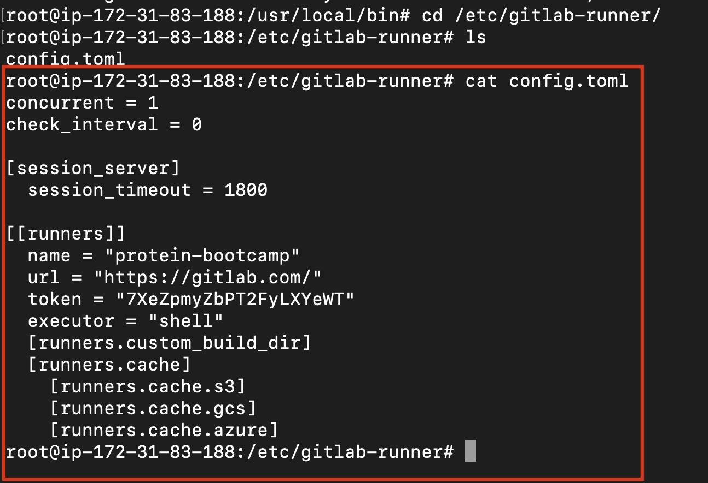

# No More GitLab Runner

Free GitLab runners are perfect for personal small projects since they are free and accessable and fully managed. On the other hand it is slightly slow. And the reason is obvios. Because they are shared with other users. 

Ain't we tired of old and slow GitLab Runners? Then this proeject is cut out exactly for you.

 

___

 

## Scope
In the bonus part of the project some additional tasks were assigned. Many of them are integrated to project itself, though two of them were semi-integrated projects. The task is put into words as:

> Instead of using GitLab's shared runners, you can configure your own runner. If you do so, please share the runner's config.toml and clarify the implementation process.

 

___

 

## Technologies
In this project we use GitLab CI/CD for our pipeline. Instead of using GitLab runners, we need our own machine where our computation will be processed. For this pupose, I've used AWS EC2 machines. For EC2 machine, I've used Linux/GNU with Debian distro but you can use any other distros. But be advised that dependincies may vary regarding to the distro.

 

___

 

## Application

1. **[Create](https://portal.aws.amazon.com/billing/signup#/start/email) an AWS account and log in.**

 

2. **Create an EC2 machine:**

	>I use t2.micro machine since it will be enough for my projet and it is free-tier eligible. Don't forget to choose your PEM because we will use it in net step.

	 

3. **Connect to EC2 machine:**

	Open an SSH client. Locate your private key file.For instance `privatekey.pem`. Then run the comment below. But replace the `privatekey.pem` with your own PEM file name and also change the `PublicIPv4DNS` address with your own EC2 machine's ip address:

	`$ssh -i "privatekey.pem" ec2-user@PublicIPv4DNS`

 

4. **Take registration token from GitLab:**

	In the GitLab repository respectively click `Settings > CI/CD > Runners`. There you will see your registration token. We will use it to connect our pipeline to our EC2 machine.

	

	 

5. **Install Gitlab Runner to EC2:**

	- Download the binary for your system 
	
		`$ sudo curl -L --output /usr/local/bin/gitlab-runner https://gitlab-runner-downloads.s3.amazonaws.com/latest/binaries/gitlab-runner-linux-amd64 `
	- Give it permission to execute
	
		`$ sudo chmod +x /usr/local/bin/gitlab-runner`
	- Create a GitLab Runner user 
	
		`$ sudo useradd --comment 'GitLab Runner' --create-home gitlab-runner --shell /bin/bash`
	- Install and run as a service 
	
		`$ sudo gitlab-runner install --user=gitlab-runner --working-directory=/home/gitlab-runner` 
	`$ sudo gitlab-runner start`

 

6. **Register Runner to EC2**

	`$ sudo gitlab-runner register --url https://gitlab.com/ --registration-token $REGISTRATION_TOKEN`
	
	Don't forget to replace your registration token in the above script.

 

7. **Activate Your Runner**

	Now you runners should be visible in  `Settings > CI/CD > Runners` like this:

	

 

8. **Deactivate Shared Runners**

	As default GitLab use shared runners. So, stop shared runners to use your runners to carry out your pipe line executions.

	

 

Congratulations! You're done. Now, you are running your pipeline on your own EC2 machine. As a result, your `Settings > CI/CD > Runners` screen should looks like this:

 

___

 

## Configuration

You can change the behavior of GitLab Runner and of individual registered runners.

To do this, you modify a file called config.toml, which uses the TOML format.

You can find the `config.toml` file in:
`/etc/gitlab-runner/`

Here as shown:

And the last but not the least; I leave my config.toml file in this directory. [You can access it here](config.toml).