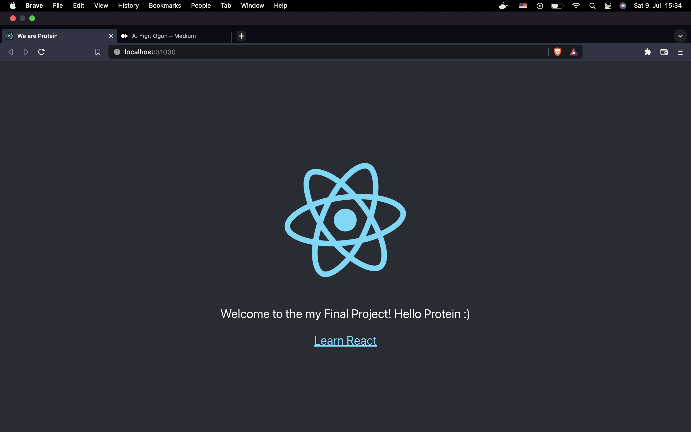

# Deploy the Application to Kubernetes

Here I have two K8s yaml files. With this manual, I will walkyou thorough how to setup our react app in a K8s cluster with these two K8S files. 

</br>

<p align="center">

</p>
	
</br>

# :link: Content

1. [About](#clipboard-about)
	- [deployment.yaml](#first-file--deploymentyaml)
	- [deployment-service.yaml](#second-file--deployment-serviceyaml)
2. [Architecture](#gear-architecture)
3. [Strategy](#brain-strategy)
	- [NodePort](#x-drawbacks-of-nodeport)
4. [Requirements](#heavyexclamationmark-requirements)
5. [Installation](#hourglassflowingsand-installation)
	- [Docker Installation](#docker-installation)
	- [Minikube installation](#minikube-installation)
6. [Application](#electricplug-application)

</br>
</br>

___
---
---


</br>

# :clipboard:  About
For my Kubernetes cluster I've done followings:

- In `deployment.yaml` file, I declared 2 replicas. I wanted to have more than one replica for resiliance and as less as possible due to the reason that I don't have enough resource on my local machine.

- I've used minikube and docker deamon instead of a VM. One of the curses of using M1 chipped machine is not being able to use Vagrant. By this method, I've used containers as node.

</br>

## First File :  **deployment.yaml**

[In this file](./deployment.yaml) I've used the [docker image](https://hub.docker.com/repository/docker/yogun/react)that I pushed to my DockerHub registry. Due to the reason of I have limited resources on my local machine, I gave a CPU and Memory limit to this container. I opened 3000 port for React App, which is actually default port used by React App.

</br>

## Second File :  **deployment-service.yaml**

Kubernetes Pods are created and destroyed to match the desired state of our cluster. Pods are nonpermanent resources. Kubernetes can create and destroy Pods dynamically and every time they are created, they get new IP. This create a problem to communicate with them. This is why, I need an abstraction level on pods. 

[In this manifest file](./deployment-service.yaml), I use `Nodeport` service. It simply listen the Pod's port.  And exposes the Service on each Node's IP at a static port (the NodePort).

</br>

# :gear: Architecture

I've used two nodes in my machine and represent the architecture regarding that. Please remember that it may divert according to your own personal use, though it will provide a bare insight. In representation, I've showed three pods. Please remember that in my YAML file I actually declared 2 pods.

</br>


</br>
</br>

# :brain: Strategy

Here I will try to share my strategy and my choices.
- Normally, it is legal to define service and deployment in same YAML file. However, spare them in term of seperation of concerns.
- I put a limit for my containers. Because my computer has limited resources and I don't want to run out of them. In case of different use cases, you may adapt them. I used really minimalist numbers because my React App is so primitive, one single static page.
- I wanted to create 2 replicas. Again, according to my use case, I wanted to go with minimum amount of use due to the face that I have limited amount of resources. On the other hand, I wanted to have more than one desired pods for resiliance. If you have more resources and more traffic coming in, feel free to create more replicas.

- In order to expose my App to the end-users, I had three options by Kubernetes as: `ClusterIP`, `NodePort` and `LoadBalancer` service types. I've chosen `NodePort` service. Because NodePort is the most basic way to publish containerized application to the outside world and I didn't want to do over-engineering. But, it is not best practice for deployment. I will mention the disadventages [down below](#drawbacks-of-nodeport).

</br>

## :x: Drawbacks of Nodeport

- The scale will be limited by the “nodePort” range number, because only one service per port can be configured.
- By default, port range is limited in the rage 30000–32767. High ports usage could be problematic, from security perspective. In my project, I've used 31000 port. I've chosen it arbitrarily.
- By design, NodePort bypasses almost all network security in Kubernetes.
- If external load-balancer is in use, the service “Heath Check” will be toward the Node IP, instead directly to the Pod one, which is a poor monitoring solution.
- More complex to troubleshoot connectivity issues.

</br>

# :heavy_exclamation_mark: Requirements

- [Docker Desktop](#docker-installation)
- [Minikube](#minikube-installation)
- [Kubectl](#kubectl-installation)

</br>

# :hourglass_flowing_sand: Installation

## Docker Installation
1. Download `Docker.dmg`
2. Go to application folder where you downloaded
3. Run the following commands
 ```bash
$ sudo hdiutil attach Docker.dmg
$ sudo /Volumes/Docker/Docker.app/Contents/MacOS/install
$ sudo hdiutil detach /Volumes/Docker
 ```

*PS: You can download the `Docker.dmg` [from this link](https://docs.docker.com/desktop/mac/install/) and install it via GUI.*

</br>

## Minikube Installation

1. Download the proper binary according to your machine and architecture. For my case I use this command below to download:
```bash
$ curl -LO https://storage.googleapis.com/minikube/releases/latest/minikube-darwin-amd64
```

2. Install the binary
```bash
$ sudo install minikube-darwin-amd64 /usr/local/bin/minikube
```

PS: [Here](https://minikube.sigs.k8s.io/docs/start/) you can learn how to install minikube. 

</br>

## Kubectl Installation

1. Download the proper binary according to your computer and it's chip. For my case I use this command below to download as M1 chip user:
```bash
$ curl -LO "https://dl.k8s.io/release/$(curl -L -s https://dl.k8s.io/release/stable.txt)/bin/darwin/arm64/kubectl"
```

2. Make the kubectl binary executable.
```bash
$ chmod +x ./kubectl
```

3. Move the kubectl binary to a file location on your system `PATH` with commands below.
```bash
$ sudo mv ./kubectl /usr/local/bin/kubectl
$ sudo chown root: /usr/local/bin/kubectl
```

4. Test to ensure the version you installed is up-to-date:
```bash
$ kubectl version --client
```

PS: [Here](https://kubernetes.io/docs/tasks/tools/install-kubectl-macos/) you can learn how to install minikube to your Mac. 


</br>


# :electric_plug: Application

I've used `minikube` due to it's simplicity. For minikube, Kubernetes says like this:

> minikube is local Kubernetes, focusing on making it easy to learn and develop for Kubernetes.
>
>All you need is Docker (or similarly compatible) container or a Virtual Machine environment, and Kubernetes is a single command away: minikube start

Therefore, our first command is going to be `minikube start` after installation of Minikube.

1. Start the minikube with following command:
```bash
$ minikube start --driver=docker
```

I've used `--driver=docker` command to tell Kubernetes that I want to user Docker Desktop instead of Virtual Machines.


</br>

2. Apply `deployment.yaml` to run the cluster up.
```bash
$ kubectl apply -f deployment.yaml
```

</br>

3. Apply `deployment-service.yaml` to expose the cluster outside.
cluster up.
```bash
$ kubectl apply -f deployment-service.yaml
```

</br>

4. Check your pods with:
```bash
$ kubectl get pods
```
As you can see I have two pods since I specified in my `deployment.yaml` [file](./deployment.yaml) as 2 replicas.


</br>

5. Check your service with:
```bash
$ kubectl get service
```
As you can see my service is up and running in 31000 port:


</br>

6. Check your deployment:
```bash
$ kubectl get deployment
```
Here we can get a quick summary about our cluster. As it seems, how many desired pods I specified and how many of them up and running can be watched.


</br>

7.  Now we are ready. Let's access our React App:

```bash
$ minikube service demo-react-app
```
Now, the React application will open in your default web browser, or you can access it on Nodeport IP-address with the port that you open for NodePort.




</br>


Congratulations! You have successfully deployed a React application in Kuberntes!!! 🥳
