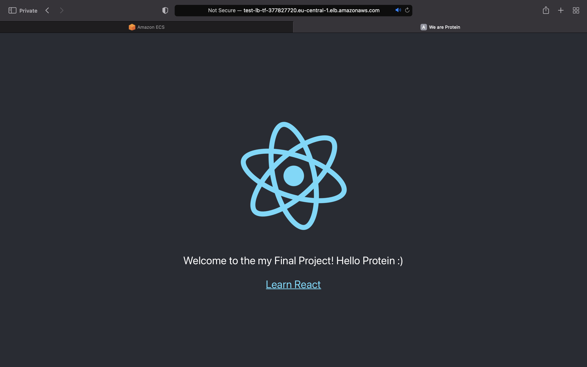
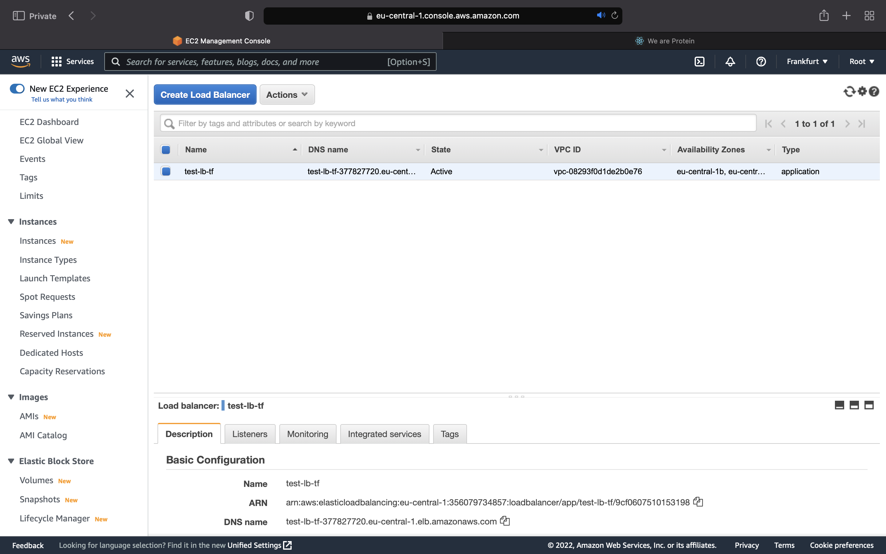
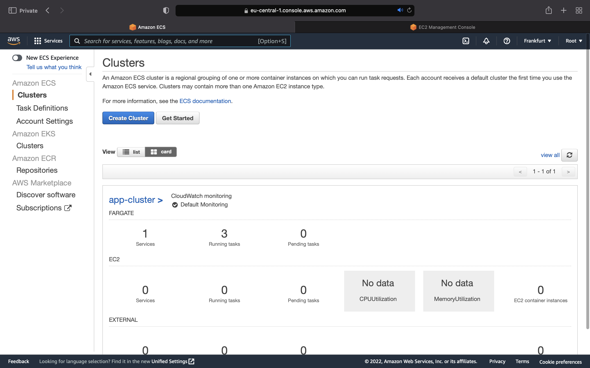
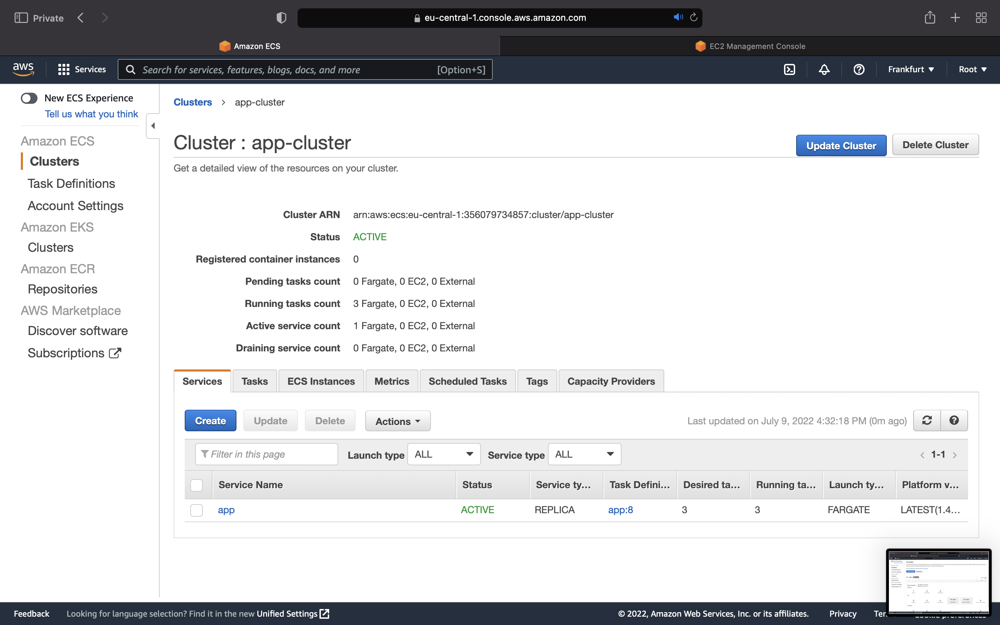
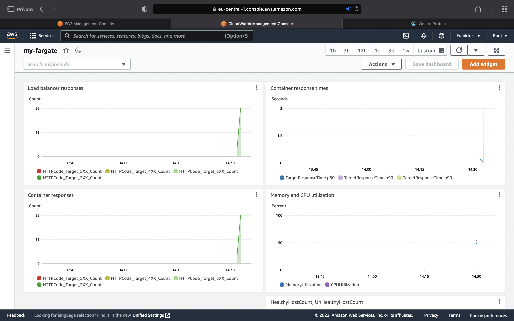
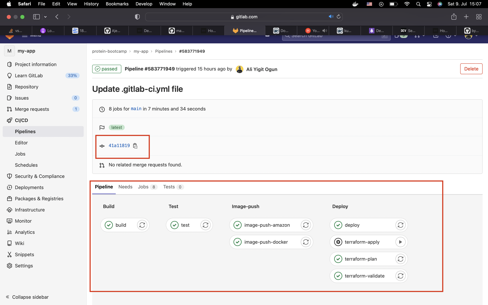
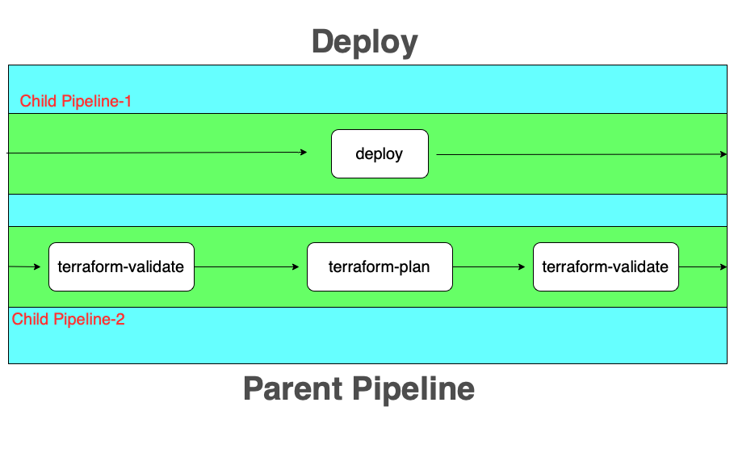
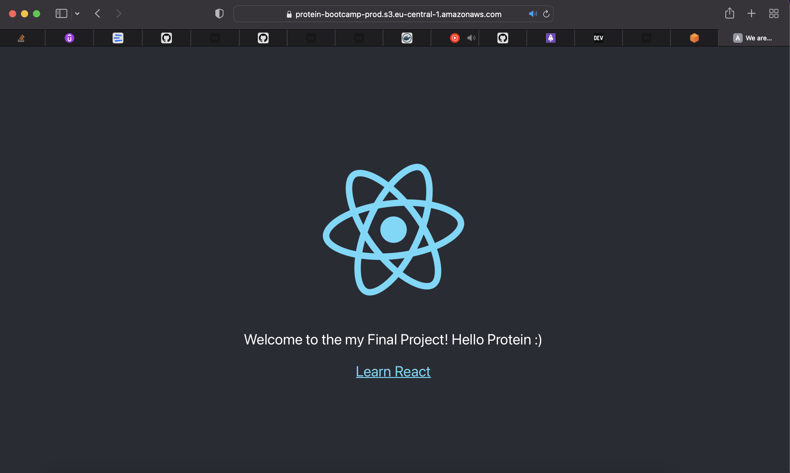
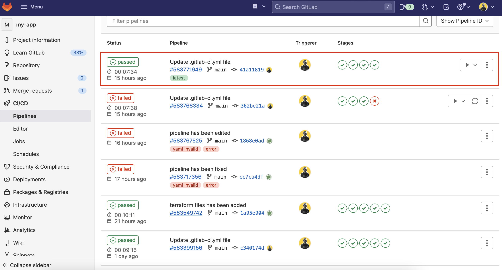
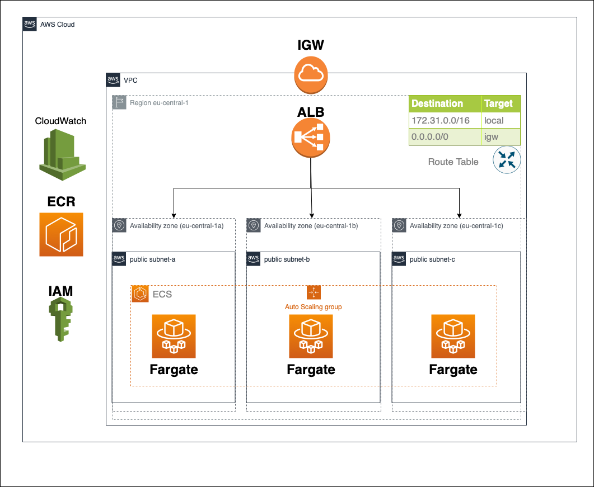

# React App with Pipeline

This project was bootstrapped with [Create React App](https://github.com/facebook/create-react-app).It is empowered with GitLab CI/CD and Docker.

<p align="center">

</p>

</br>

# Content

1. [Technologies](#💻-technologies)
2. [About](#📋-about)
3. [Dockerize](#📦-dockerize)
4. [Deployment](#🚀-deployment)
	- [Terraform](#🌱-terraform)
		- [main.tf](#maintf)
		- [asg.tf](#asgtf)
		- [dashboard.tf](#dashboardtf)
		- [provider.tf](#providertf)
		- [vars.tf](#varstf)
		- [versions.tf](#versionstf)
	- [CI/CD Pipeline](#♾️-cicd-pipeline)
		- [Architecture](#⚙️-pipeline-architecture)
	- [AWS](#☁️-amazon-web-services)
		- [Reources](#aws-resources)
		- [Architecture](#⚙️-aws-architecture)

</br>

# 💻 Technologies

<span>


 


</span>

</br>

<span>


</span>

</br>
</br>

# 📋 About

Here I have a simple primitive React App. With [Dockerfile](./Dockerfile), I dockerize my React App. I try to keep this docker image
as small as possible with `.dockerignore` file. I deploy my React App on to AWS and provision my infrastructure witjh Terraform. In order to improve the efficiency, I built a CI/CD pipeline on GitLab.

</br>

# 📦 Dockerize

In order to keep my docker image as small as possible, I've done 2 things:
- I've used `.dockerignore` file to excluded unnecessary files
- I've used `node:slim` as base image. As the word "slim" imply, this image is slim version of node image. I've used node image to be able to use `npm` package manager.

In my Docker image, I've used two main commands. First, I've build the artifact form the files with:
```bash
$ npm run build
```
Then, I've run the artifact with:
```bash
$ npm start
```

# 🚀 Deployment

In order to provision my deployment, I've prepared a bunch of HCL files. With this HCL files' I aimied to deploy my React App on AWS ECS Fargate. My AWS ECS Fargate deployment infrastructure was specified with such **neccesities**:
-  Application should be running on ECS Fargate.
- The necessary VPC and security group settings are made.
- Application load balancer is configured in front of the service.
- Auto Scaling Group has been configured as to scale-up when CPU is above %50 and scale-down when CPU is below %20.
- The proper Cloudwatch dashboards and metrics for monitoring the performance of the application should be created.

I use a GitLab CI/CD [pipeline](#pipeline) to carry out the deployment which I will cover in upcoming section more detailed. Here is a sample view of my React App running on AWS with Terraform provisioned and pipelined with GitLab CI/CD:



</br>

## 🌱 Terraform

 Let's walk thorough a bit `.tf` files and fill the gap about how do I carry out these deployment neccessities with Terraform. You can access all **Terraform** files [here under this directory](./terraform-ecs-fargate/) in `terraform-ecs-fargate` folder.
 </br>

### `main.tf`

#### VPC

- With `aws_default_vpc` I am starting a default vpc. A default VPC comes with a public subnet in each Availability Zone, an internet gateway, and settings to enable DNS resolution.

#### SUBNET

- The `aws_default_subnet` aws_default_subnet resource behaves differently from normal resources in that if a default subnet exists in the specified Availability Zone, Terraform does not create this resource, but instead "adopts" it into management. By default, a default subnet is a public subnet, because the main route table sends the subnet's traffic that is destined for the internet to the internet gateway. You can make a default subnet into a private subnet. But I want my subnet to bu public. In this resource, I specified my zone as `eu-central` which is Frankfurt region. For resiliance I created one subnet in each `AZ`.

#### ECR

- `aws_ecr_repository` provides an Elastic Container Registry Repository.

#### IAM

- `aws_iam_role`provides an IAM role for ECS cluster.
- `aws_iam_policy_document` generates an IAM policy document in JSON format for use with `aws_iam_role` resource.

#### ALB

- `aws_alb` is application load balancer which is placed in front of the services. In this service, I specifyto which subnets to direct the traffic.



</br>

#### SECURITY GROUP

- with `aws_security_group` resouce provides a security group.

#### ECS

- `aws_ecs_cluster` provides an ECS cluster.
- `aws_ecs_task_definition` manages a revision of an ECS task definition to be used in aws_ecs_service. Here I specify that I want to use Fargate and I want to limit my containers' Memory and CPU.
- `aws_ecs_service` provides an ECS service - effectively a task that is expected to run until an error occurs or a user terminates it. It allows us to run and maintain a specified number of instances of a task definition simultaneously in an Amazon ECS cluster. If any of our tasks should fail or stop for any reason, the Amazon ECS service scheduler launches another instance of our task definition to replace it in order to maintain the desired number of tasks in the service.






</br>

### `asg.tf`

Auto Scaling Group, or simply ASG. At the beginning of [this file](./asg.tf), I specify some threshold values such as:
- If CPU use drops down below 20% , I want to turn off one of my containers.
- If CPU use exceeds 50% , I want to add off one more container to my cluster.
- I want to have minimum 2 containers running.
- I want to have maximum 9 containers running.

With `aws_appautoscaling_policy` resource, I specify that I want to increase or decrease one container at a time. 

With `aws_cloudwatch_metric_alarm` I specify how to watch the cluster and gather neccessary data from cluster.

Anf finally with the `aws_appautoscaling_target` resource I am pointing out which cluster I want to apply this ASG to.

</br>

### `dashboard.tf`

In this file I create a CloudWatch dashboard to closely monitorize my cluster. In order to do that, I use `aws_cloudwatch_dashboard` resource. Here I created four graphics in order to monitorize my cluster as:
- Load Balacner Responses by the Time
- Container Response Times by the Time
- Container Responses by the Time
- Memory and CPU Utilization by the Time

</br>



</br>

### `provider.tf`

Here I specify which provider to use and where the variables are located.

</br>

### `vars.tf`

Here I specify which Region to provision my infrastructure, my secret and public key.

</br>

### `versions.tf`

Here I specify dependincy about which Terraform version I need.

</br>
</br>

## ♾️ CI/CD Pipeline

For pipeline, I use [GitLab CI/CD](https://docs.gitlab.com/ee/ci/). In order to provision my pipeline, I use `.gitlab-ci.yml` file. 

**IMPORTANT:** Before use of this file, please remember to add those:
- Docker Hub ID
- Docker Hub password
- AWS ACCOUNT ID
- AWS_ACCESS_KEY (I added as Masked Variables)
- AWS_SECRET_KEY (I added as Masked Variables)

### ⚙️ Pipeline Architecture

I designed my pipeline with 4 stages and 9 jobs as seen in the figure:



Actually, last stage behaves kind of like parent stage which accomodates 2 different pipeline. For more information, you can jump [here](#deployment-stage). Anyway, my CI/CD pipeline's stages are like down below:
- Build
- Test
- Image-push
- Deploy

#### Build Stage

Here I build the artifac and there is nothing more. 

</br>

#### Test Stage

Here I do tests with `npm test` command. One important thing is, `npm test` requires an interactive use. In order to turn this off, I've used `CI=true` parameter.

</br>

#### Image-push Stage
In this stage I dockerize my React App. I push this image seperately into two different registries as Docker Hub and AWS ECR. This stage has two jobs as:
- `image-push-amazon`
- `image-push-docker`

</br>

#### Deployment Stage

This stage has four jobs as:
- `deploy`
- `terraform-validate`
- `terraform-plan`
- `terraform-apply`

As mentioned previously, this stage accomodates two child pipelines. More accurate representation of this stage would be like:




In `deploy` job, I am deploying my React App to AWS S3. By this way I am hoping to access my React App and represent a demo.

#### S3

>Here is the link of my React App, if you would like to take a look at it:

>https://protein-bootcamp-prod.s3.eu-central-1.amazonaws.com/index.html

If you are not willing to click the link, let me leave here an image for you to see how it works:)



</br>

In, `terraform-validate` job, I am validating my Terraform configuration files in the directory. If everything works well, it pipeline continues with `terraform-plan` job. In this job, this command reads the current state of any already-existing remote objects to make sure that the Terraform state is up-to-date and also, compares the current configuration to the prior state and noting any differences. If everythin is okay, it continues with `terraform-apply` job. In this stage I am creating all the objects provisioned by the Terraform files. However, I set this job as manual. Because, this is the final step before creationg of AWS objects which will cost us money. So, it is good practice to leave this to a team leader. 

So, here it seems my final succesfull pipeline run after a bunch of failure :)



</br>
</br>

## ☁️ Amazon Web Services

I use AWS as Cloud Provider in this projet. I tried to use Free-tier services. Anyway, it is always good practice to set an alert threshold in budget. Watch out your money!

### AWS Resources

The services I've been using on AWS are like:

- [ECS](#ecs)
- [Fargate](#ecs)
- [S3](#s3)
- [IAM](#iam)
- [Security Groups](#security-group)
- [VPC](#vpc)
- [Subnet](#subnet)
- [ASG](#asgtf)
- [CloudWatch](#dashboardtf)
- [ECR](#ecr)
- [IGW](#aws-architecture)

### ⚙️ AWS Architecture

Here in this image below, you can see details of AWS architecture.



In order to read further about the service itself, you can go the relevant section above in particular service.